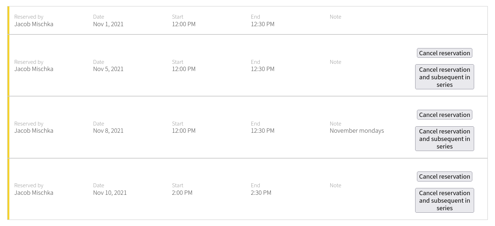
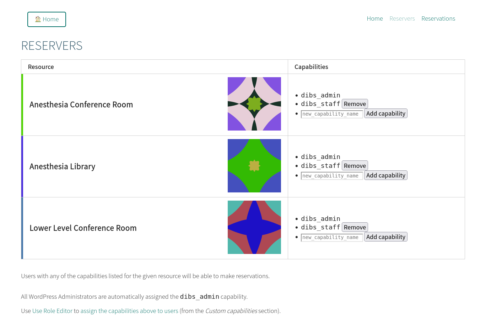

# Dibs

A simple reservations plugin for WordPress.

Supports recurring events, list and calendar reservations views, double-booking
prevention, and resource level reservation permissions controllable via
WordPress capabilities.

## Adding to site

Use the `[dibs-app /]` shortcode to add the app to a page or post.
